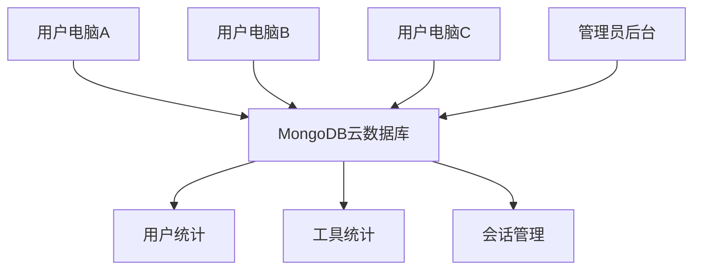

# MongoDB后台管理统计系统设计方案

## 1. 架构优势分析

### ✅ **MongoDB完美解决跨设备登录问题**



**核心优势**：
- ✅ **跨设备登录** - 用户可在任意设备使用同一账号
- ✅ **实时数据同步** - 所有设备数据实时同步
- ✅ **统一管理** - 管理员可统一管理所有用户
- ✅ **云端备份** - 数据安全，永不丢失

## 2. MongoDB数据库设计

### 2.1 集合结构设计

```javascript
// users 集合 - 用户信息
{
  _id: ObjectId("..."),
  username: "user001",
  password_hash: "$2b$12$...", // bcrypt加密
  email: "user@example.com",
  role: "user", // "admin" | "user"
  is_active: true,
  profile: {
    display_name: "用户001",
    avatar_url: null,
    preferences: {
      theme: "light",
      language: "zh-CN"
    }
  },
  stats: {
    total_usage_time: 3600, // 总使用时长（秒）
    login_count: 25,
    last_login_at: ISODate("2025-07-31T10:30:00Z"),
    created_at: ISODate("2025-07-01T08:00:00Z")
  }
}

// tool_usage 集合 - 工具使用统计
{
  _id: ObjectId("..."),
  user_id: ObjectId("..."), // 关联用户
  tool_id: 1,
  tool_name: "AI写作助手",
  tool_category: "运营工具",
  usage_stats: {
    click_count: 150,
    total_usage_time: 7200, // 使用时长（秒）
    last_used_at: ISODate("2025-07-31T10:30:00Z"),
    first_used_at: ISODate("2025-07-15T09:00:00Z")
  },
  daily_stats: [
    {
      date: "2025-07-31",
      clicks: 10,
      usage_time: 600
    }
  ]
}

// user_sessions 集合 - 用户会话记录
{
  _id: ObjectId("..."),
  user_id: ObjectId("..."),
  session_info: {
    login_at: ISODate("2025-07-31T08:00:00Z"),
    logout_at: ISODate("2025-07-31T10:30:00Z"),
    session_duration: 9000, // 会话时长（秒）
    ip_address: "192.168.1.100",
    user_agent: "Tauri/2.0",
    device_info: {
      os: "Windows 11",
      app_version: "1.0.16"
    }
  }
}

// system_logs 集合 - 系统操作日志
{
  _id: ObjectId("..."),
  user_id: ObjectId("..."),
  log_info: {
    action_type: "tool_access", // "login", "logout", "tool_access", "admin_action"
    action_detail: {
      tool_id: 1,
      tool_name: "AI写作助手",
      duration: 300
    },
    timestamp: ISODate("2025-07-31T10:30:00Z"),
    ip_address: "192.168.1.100",
    success: true
  }
}

// daily_aggregates 集合 - 每日汇总统计（性能优化）
{
  _id: ObjectId("..."),
  date: "2025-07-31",
  stats: {
    total_users: 100,
    active_users: 45,
    total_sessions: 120,
    total_usage_time: 86400,
    tool_stats: [
      {
        tool_id: 1,
        tool_name: "AI写作助手",
        total_clicks: 500,
        total_usage_time: 18000,
        unique_users: 25
      }
    ]
  },
  created_at: ISODate("2025-08-01T00:00:00Z")
}
```

### 2.2 索引优化策略

```javascript
// users 集合索引
db.users.createIndex({ "username": 1 }, { unique: true })
db.users.createIndex({ "email": 1 }, { sparse: true })
db.users.createIndex({ "role": 1 })
db.users.createIndex({ "stats.last_login_at": -1 })
db.users.createIndex({ "is_active": 1 })

// tool_usage 集合索引
db.tool_usage.createIndex({ "user_id": 1, "tool_id": 1 }, { unique: true })
db.tool_usage.createIndex({ "tool_id": 1 })
db.tool_usage.createIndex({ "usage_stats.last_used_at": -1 })
db.tool_usage.createIndex({ "daily_stats.date": 1 })

// user_sessions 集合索引
db.user_sessions.createIndex({ "user_id": 1 })
db.user_sessions.createIndex({ "session_info.login_at": -1 })
db.user_sessions.createIndex({ "session_info.logout_at": -1 })

// system_logs 集合索引
db.system_logs.createIndex({ "user_id": 1 })
db.system_logs.createIndex({ "log_info.timestamp": -1 })
db.system_logs.createIndex({ "log_info.action_type": 1 })

// daily_aggregates 集合索引
db.daily_aggregates.createIndex({ "date": -1 }, { unique: true })
```

## 3. Rust后端实现

### 3.1 MongoDB连接管理

```rust
use mongodb::{Client, Database, Collection};
use serde::{Deserialize, Serialize};
use std::sync::Arc;
use tokio::sync::RwLock;

#[derive(Clone)]
pub struct MongoManager {
    client: Client,
    database: Database,
}

impl MongoManager {
    pub async fn new(connection_string: &str, db_name: &str) -> Result<Self, mongodb::error::Error> {
        let client = Client::with_uri_str(connection_string).await?;
        let database = client.database(db_name);
        
        // 测试连接
        database.run_command(doc! {"ping": 1}, None).await?;
        
        Ok(MongoManager {
            client,
            database,
        })
    }
    
    pub fn users(&self) -> Collection<User> {
        self.database.collection("users")
    }
    
    pub fn tool_usage(&self) -> Collection<ToolUsage> {
        self.database.collection("tool_usage")
    }
    
    pub fn user_sessions(&self) -> Collection<UserSession> {
        self.database.collection("user_sessions")
    }
    
    pub fn system_logs(&self) -> Collection<SystemLog> {
        self.database.collection("system_logs")
    }
    
    pub fn daily_aggregates(&self) -> Collection<DailyAggregate> {
        self.database.collection("daily_aggregates")
    }
}

#[derive(Debug, Serialize, Deserialize)]
pub struct User {
    #[serde(rename = "_id", skip_serializing_if = "Option::is_none")]
    pub id: Option<mongodb::bson::oid::ObjectId>,
    pub username: String,
    pub password_hash: String,
    pub email: Option<String>,
    pub role: String,
    pub is_active: bool,
    pub profile: UserProfile,
    pub stats: UserStats,
}

#[derive(Debug, Serialize, Deserialize)]
pub struct UserProfile {
    pub display_name: String,
    pub avatar_url: Option<String>,
    pub preferences: UserPreferences,
}

#[derive(Debug, Serialize, Deserialize)]
pub struct UserPreferences {
    pub theme: String,
    pub language: String,
}

#[derive(Debug, Serialize, Deserialize)]
pub struct UserStats {
    pub total_usage_time: i64,
    pub login_count: i64,
    pub last_login_at: Option<mongodb::bson::DateTime>,
    pub created_at: mongodb::bson::DateTime,
}
```

### 3.2 统计查询API

```rust
use mongodb::bson::{doc, Document};
use futures::stream::TryStreamExt;

// 获取系统概览统计
#[tauri::command]
pub async fn get_system_overview(
    mongo: tauri::State<'_, Arc<RwLock<MongoManager>>>,
) -> Result<SystemOverview, String> {
    let mongo = mongo.read().await;
    
    // 获取总用户数
    let total_users = mongo.users()
        .count_documents(doc! {"is_active": true}, None)
        .await
        .map_err(|e| e.to_string())? as i64;
    
    // 获取今日活跃用户数
    let today = chrono::Utc::now().date_naive();
    let today_start = mongodb::bson::DateTime::from_chrono(
        today.and_hms_opt(0, 0, 0).unwrap().and_utc()
    );
    
    let active_users_today = mongo.user_sessions()
        .count_documents(
            doc! {"session_info.login_at": {"$gte": today_start}}, 
            None
        )
        .await
        .map_err(|e| e.to_string())? as i64;
    
    // 获取最受欢迎的工具
    let pipeline = vec![
        doc! {
            "$group": {
                "_id": "$tool_id",
                "tool_name": {"$first": "$tool_name"},
                "total_clicks": {"$sum": "$usage_stats.click_count"},
                "total_usage_time": {"$sum": "$usage_stats.total_usage_time"},
                "unique_users": {"$addToSet": "$user_id"}
            }
        },
        doc! {
            "$addFields": {
                "unique_user_count": {"$size": "$unique_users"}
            }
        },
        doc! {
            "$sort": {"total_clicks": -1}
        },
        doc! {
            "$limit": 10
        }
    ];
    
    let mut cursor = mongo.tool_usage().aggregate(pipeline, None).await.map_err(|e| e.to_string())?;
    let mut popular_tools = Vec::new();
    
    while let Some(doc) = cursor.try_next().await.map_err(|e| e.to_string())? {
        if let Ok(tool) = mongodb::bson::from_document::<PopularTool>(doc) {
            popular_tools.push(tool);
        }
    }
    
    Ok(SystemOverview {
        total_users,
        active_users_today,
        total_sessions: 0, // 可以添加具体查询
        most_popular_tools: popular_tools,
        usage_trends: vec![], // 可以添加趋势查询
    })
}

// 获取用户统计
#[tauri::command]
pub async fn get_user_statistics(
    mongo: tauri::State<'_, Arc<RwLock<MongoManager>>>,
    user_id: Option<String>,
    date_range: Option<(String, String)>,
) -> Result<Vec<UserStatsResponse>, String> {
    let mongo = mongo.read().await;
    
    let mut match_stage = doc! {};
    
    if let Some(uid) = user_id {
        if let Ok(object_id) = mongodb::bson::oid::ObjectId::parse_str(&uid) {
            match_stage.insert("_id", object_id);
        }
    }
    
    let pipeline = vec![
        doc! {"$match": match_stage},
        doc! {
            "$lookup": {
                "from": "tool_usage",
                "localField": "_id",
                "foreignField": "user_id",
                "as": "tool_usage"
            }
        },
        doc! {
            "$addFields": {
                "total_tool_clicks": {"$sum": "$tool_usage.usage_stats.click_count"},
                "total_tool_usage_time": {"$sum": "$tool_usage.usage_stats.total_usage_time"}
            }
        },
        doc! {
            "$sort": {"stats.last_login_at": -1}
        }
    ];
    
    let mut cursor = mongo.users().aggregate(pipeline, None).await.map_err(|e| e.to_string())?;
    let mut results = Vec::new();
    
    while let Some(doc) = cursor.try_next().await.map_err(|e| e.to_string())? {
        if let Ok(user_stat) = mongodb::bson::from_document::<UserStatsResponse>(doc) {
            results.push(user_stat);
        }
    }
    
    Ok(results)
}

// 实时统计更新
#[tauri::command]
pub async fn track_user_activity(
    mongo: tauri::State<'_, Arc<RwLock<MongoManager>>>,
    user_id: String,
    activity_type: String,
    tool_id: Option<i32>,
    duration: Option<i64>,
) -> Result<(), String> {
    let mongo = mongo.read().await;
    let user_object_id = mongodb::bson::oid::ObjectId::parse_str(&user_id)
        .map_err(|e| e.to_string())?;

    match activity_type.as_str() {
        "tool_click" => {
            if let Some(tid) = tool_id {
                // 更新或插入工具使用记录
                let filter = doc! {
                    "user_id": user_object_id,
                    "tool_id": tid
                };

                let update = doc! {
                    "$inc": {"usage_stats.click_count": 1},
                    "$set": {"usage_stats.last_used_at": mongodb::bson::DateTime::now()},
                    "$setOnInsert": {
                        "tool_name": "工具名称", // 需要从工具数据获取
                        "tool_category": "分类",
                        "usage_stats.first_used_at": mongodb::bson::DateTime::now()
                    }
                };

                mongo.tool_usage()
                    .update_one(filter, update, mongodb::options::UpdateOptions::builder().upsert(true).build())
                    .await
                    .map_err(|e| e.to_string())?;
            }
        },
        "tool_usage" => {
            if let (Some(tid), Some(dur)) = (tool_id, duration) {
                let filter = doc! {
                    "user_id": user_object_id,
                    "tool_id": tid
                };

                let update = doc! {
                    "$inc": {"usage_stats.total_usage_time": dur}
                };

                mongo.tool_usage()
                    .update_one(filter, update, None)
                    .await
                    .map_err(|e| e.to_string())?;
            }
        },
        _ => return Err("未知的活动类型".to_string()),
    }

    // 记录系统日志
    let log = SystemLog {
        id: None,
        user_id: user_object_id,
        log_info: LogInfo {
            action_type: activity_type,
            action_detail: doc! {
                "tool_id": tool_id,
                "duration": duration
            },
            timestamp: mongodb::bson::DateTime::now(),
            ip_address: "127.0.0.1".to_string(), // 实际应用中获取真实IP
            success: true,
        },
    };

    mongo.system_logs()
        .insert_one(log, None)
        .await
        .map_err(|e| e.to_string())?;

    Ok(())
}

#[derive(Debug, Serialize, Deserialize)]
pub struct SystemLog {
    #[serde(rename = "_id", skip_serializing_if = "Option::is_none")]
    pub id: Option<mongodb::bson::oid::ObjectId>,
    pub user_id: mongodb::bson::oid::ObjectId,
    pub log_info: LogInfo,
}

#[derive(Debug, Serialize, Deserialize)]
pub struct LogInfo {
    pub action_type: String,
    pub action_detail: Document,
    pub timestamp: mongodb::bson::DateTime,
    pub ip_address: String,
    pub success: bool,
}

#[derive(Debug, Serialize, Deserialize)]
pub struct PopularTool {
    #[serde(rename = "_id")]
    pub tool_id: i32,
    pub tool_name: String,
    pub total_clicks: i64,
    pub total_usage_time: i64,
    pub unique_user_count: i32,
}

#[derive(Debug, Serialize, Deserialize)]
pub struct UserStatsResponse {
    #[serde(rename = "_id")]
    pub id: mongodb::bson::oid::ObjectId,
    pub username: String,
    pub stats: UserStats,
    pub total_tool_clicks: i64,
    pub total_tool_usage_time: i64,
}

#[derive(Debug, Serialize, Deserialize)]
pub struct SystemOverview {
    pub total_users: i64,
    pub active_users_today: i64,
    pub total_sessions: i64,
    pub most_popular_tools: Vec<PopularTool>,
    pub usage_trends: Vec<DailyUsage>,
}

#[derive(Debug, Serialize, Deserialize)]
pub struct DailyUsage {
    pub date: String,
    pub total_usage_time: i64,
    pub unique_users: i64,
}
```

## 4. 管理员后台界面

### 4.1 MongoDB数据可视化

```typescript
// components/admin/mongodb-dashboard.tsx
'use client'

import { useState, useEffect } from 'react'
import { Card, CardContent, CardDescription, CardHeader, CardTitle } from '@/components/ui/card'
import { Tabs, TabsContent, TabsList, TabsTrigger } from '@/components/ui/tabs'
import { Badge } from '@/components/ui/badge'
import { Button } from '@/components/ui/button'
import { invoke } from '@tauri-apps/api/tauri'
import {
  BarChart, Bar, XAxis, YAxis, CartesianGrid, Tooltip, ResponsiveContainer,
  PieChart, Pie, Cell, LineChart, Line, Area, AreaChart
} from 'recharts'

export function MongoDBDashboard() {
  const [overview, setOverview] = useState<SystemOverview | null>(null)
  const [userStats, setUserStats] = useState<UserStatsResponse[]>([])
  const [toolRankings, setToolRankings] = useState<PopularTool[]>([])
  const [loading, setLoading] = useState(true)

  useEffect(() => {
    loadDashboardData()
  }, [])

  const loadDashboardData = async () => {
    try {
      setLoading(true)
      const [overviewData, usersData, toolsData] = await Promise.all([
        invoke<SystemOverview>('get_system_overview'),
        invoke<UserStatsResponse[]>('get_user_statistics'),
        invoke<PopularTool[]>('get_tool_rankings', { limit: 10 })
      ])

      setOverview(overviewData)
      setUserStats(usersData)
      setToolRankings(toolsData)
    } catch (error) {
      console.error('加载仪表板数据失败:', error)
    } finally {
      setLoading(false)
    }
  }

  const formatUsageTime = (seconds: number) => {
    const hours = Math.floor(seconds / 3600)
    const minutes = Math.floor((seconds % 3600) / 60)
    return `${hours}h ${minutes}m`
  }

  if (loading) {
    return (
      <div className="flex items-center justify-center h-64">
        <div className="animate-spin rounded-full h-8 w-8 border-b-2 border-blue-600"></div>
        <span className="ml-2">加载MongoDB数据中...</span>
      </div>
    )
  }

  return (
    <div className="space-y-6">
      {/* MongoDB连接状态 */}
      <Card className="border-green-200 bg-green-50">
        <CardHeader>
          <CardTitle className="text-green-800 flex items-center">
            <div className="w-3 h-3 bg-green-500 rounded-full mr-2"></div>
            MongoDB连接状态
          </CardTitle>
        </CardHeader>
        <CardContent>
          <p className="text-green-700">
            ✅ 已连接到云端MongoDB数据库 - 支持跨设备登录和实时数据同步
          </p>
        </CardContent>
      </Card>

      {/* 概览统计卡片 */}
      <div className="grid grid-cols-1 md:grid-cols-4 gap-4">
        <Card>
          <CardHeader className="flex flex-row items-center justify-between space-y-0 pb-2">
            <CardTitle className="text-sm font-medium">总用户数</CardTitle>
            <Badge variant="secondary">MongoDB</Badge>
          </CardHeader>
          <CardContent>
            <div className="text-2xl font-bold">{overview?.total_users}</div>
            <p className="text-xs text-muted-foreground">支持跨设备登录</p>
          </CardContent>
        </Card>

        <Card>
          <CardHeader className="flex flex-row items-center justify-between space-y-0 pb-2">
            <CardTitle className="text-sm font-medium">今日活跃用户</CardTitle>
            <Badge variant="secondary">实时</Badge>
          </CardHeader>
          <CardContent>
            <div className="text-2xl font-bold">{overview?.active_users_today}</div>
            <p className="text-xs text-muted-foreground">实时统计更新</p>
          </CardContent>
        </Card>

        <Card>
          <CardHeader className="flex flex-row items-center justify-between space-y-0 pb-2">
            <CardTitle className="text-sm font-medium">工具使用总次数</CardTitle>
            <Badge variant="secondary">聚合</Badge>
          </CardHeader>
          <CardContent>
            <div className="text-2xl font-bold">
              {toolRankings.reduce((sum, tool) => sum + tool.total_clicks, 0)}
            </div>
            <p className="text-xs text-muted-foreground">MongoDB聚合查询</p>
          </CardContent>
        </Card>

        <Card>
          <CardHeader className="flex flex-row items-center justify-between space-y-0 pb-2">
            <CardTitle className="text-sm font-medium">数据同步状态</CardTitle>
            <Badge variant="default">正常</Badge>
          </CardHeader>
          <CardContent>
            <div className="text-2xl font-bold text-green-600">100%</div>
            <p className="text-xs text-muted-foreground">云端实时同步</p>
          </CardContent>
        </Card>
      </div>

      {/* 详细统计 */}
      <Tabs defaultValue="users" className="space-y-4">
        <TabsList>
          <TabsTrigger value="users">用户分析</TabsTrigger>
          <TabsTrigger value="tools">工具统计</TabsTrigger>
          <TabsTrigger value="realtime">实时监控</TabsTrigger>
          <TabsTrigger value="aggregation">数据聚合</TabsTrigger>
        </TabsList>

        <TabsContent value="users" className="space-y-4">
          <div className="grid grid-cols-1 lg:grid-cols-2 gap-4">
            <Card>
              <CardHeader>
                <CardTitle>用户活跃度分析</CardTitle>
                <CardDescription>基于MongoDB聚合管道的用户统计</CardDescription>
              </CardHeader>
              <CardContent>
                <ResponsiveContainer width="100%" height={300}>
                  <BarChart data={userStats.slice(0, 10)}>
                    <CartesianGrid strokeDasharray="3 3" />
                    <XAxis dataKey="username" />
                    <YAxis />
                    <Tooltip formatter={(value, name) => [
                      name === 'total_tool_usage_time' ? formatUsageTime(value as number) : value,
                      name === 'total_tool_usage_time' ? '使用时长' : '登录次数'
                    ]} />
                    <Bar dataKey="stats.login_count" fill="#8884d8" name="登录次数" />
                  </BarChart>
                </ResponsiveContainer>
              </CardContent>
            </Card>

            <Card>
              <CardHeader>
                <CardTitle>用户使用时长分布</CardTitle>
                <CardDescription>MongoDB实时统计数据</CardDescription>
              </CardHeader>
              <CardContent>
                <ResponsiveContainer width="100%" height={300}>
                  <AreaChart data={userStats.slice(0, 10)}>
                    <CartesianGrid strokeDasharray="3 3" />
                    <XAxis dataKey="username" />
                    <YAxis />
                    <Tooltip formatter={(value) => [formatUsageTime(value as number), '使用时长']} />
                    <Area
                      type="monotone"
                      dataKey="total_tool_usage_time"
                      stroke="#82ca9d"
                      fill="#82ca9d"
                      fillOpacity={0.6}
                    />
                  </AreaChart>
                </ResponsiveContainer>
              </CardContent>
            </Card>
          </div>
        </TabsContent>

        <TabsContent value="tools" className="space-y-4">
          <Card>
            <CardHeader>
              <CardTitle>工具使用排行榜</CardTitle>
              <CardDescription>MongoDB聚合查询 - 实时更新</CardDescription>
            </CardHeader>
            <CardContent>
              <div className="space-y-4">
                {toolRankings.map((tool, index) => (
                  <div key={tool.tool_id} className="flex items-center justify-between p-4 border rounded-lg hover:bg-gray-50">
                    <div className="flex items-center space-x-4">
                      <Badge variant={index < 3 ? "default" : "secondary"}>
                        #{index + 1}
                      </Badge>
                      <div>
                        <p className="font-medium">{tool.tool_name}</p>
                        <p className="text-sm text-gray-500">
                          {tool.unique_user_count} 个用户使用
                        </p>
                      </div>
                    </div>
                    <div className="text-right">
                      <p className="font-medium text-blue-600">{tool.total_clicks} 次点击</p>
                      <p className="text-sm text-gray-500">
                        {formatUsageTime(tool.total_usage_time)}
                      </p>
                    </div>
                  </div>
                ))}
              </div>
            </CardContent>
          </Card>
        </TabsContent>

        <TabsContent value="realtime" className="space-y-4">
          <Card>
            <CardHeader>
              <CardTitle>实时活动监控</CardTitle>
              <CardDescription>MongoDB Change Streams - 实时数据流</CardDescription>
            </CardHeader>
            <CardContent>
              <div className="space-y-4">
                <div className="flex items-center justify-between p-3 bg-green-50 border border-green-200 rounded-lg">
                  <div className="flex items-center space-x-3">
                    <div className="w-2 h-2 bg-green-500 rounded-full animate-pulse"></div>
                    <span className="text-green-800">实时数据同步正常</span>
                  </div>
                  <Badge variant="outline" className="text-green-600 border-green-600">
                    MongoDB Connected
                  </Badge>
                </div>

                <div className="grid grid-cols-1 md:grid-cols-3 gap-4">
                  <div className="p-4 border rounded-lg">
                    <h4 className="font-medium mb-2">最近登录</h4>
                    <p className="text-2xl font-bold text-blue-600">
                      {overview?.active_users_today}
                    </p>
                    <p className="text-sm text-gray-500">今日活跃用户</p>
                  </div>

                  <div className="p-4 border rounded-lg">
                    <h4 className="font-medium mb-2">工具使用</h4>
                    <p className="text-2xl font-bold text-green-600">
                      {toolRankings.reduce((sum, tool) => sum + tool.total_clicks, 0)}
                    </p>
                    <p className="text-sm text-gray-500">总点击次数</p>
                  </div>

                  <div className="p-4 border rounded-lg">
                    <h4 className="font-medium mb-2">数据库状态</h4>
                    <p className="text-2xl font-bold text-purple-600">正常</p>
                    <p className="text-sm text-gray-500">MongoDB连接</p>
                  </div>
                </div>
              </div>
            </CardContent>
          </Card>
        </TabsContent>

        <TabsContent value="aggregation" className="space-y-4">
          <Card>
            <CardHeader>
              <CardTitle>MongoDB聚合分析</CardTitle>
              <CardDescription>高级数据分析和聚合查询结果</CardDescription>
            </CardHeader>
            <CardContent>
              <div className="grid grid-cols-1 lg:grid-cols-2 gap-4">
                <div className="space-y-4">
                  <h4 className="font-medium">用户行为聚合</h4>
                  <div className="space-y-2">
                    <div className="flex justify-between p-2 bg-gray-50 rounded">
                      <span>平均会话时长</span>
                      <span className="font-medium">
                        {userStats.length > 0
                          ? formatUsageTime(userStats.reduce((sum, user) => sum + user.total_tool_usage_time, 0) / userStats.length)
                          : '0h 0m'
                        }
                      </span>
                    </div>
                    <div className="flex justify-between p-2 bg-gray-50 rounded">
                      <span>平均登录次数</span>
                      <span className="font-medium">
                        {userStats.length > 0
                          ? Math.round(userStats.reduce((sum, user) => sum + user.stats.login_count, 0) / userStats.length)
                          : 0
                        }
                      </span>
                    </div>
                  </div>
                </div>

                <div className="space-y-4">
                  <h4 className="font-medium">工具使用聚合</h4>
                  <div className="space-y-2">
                    <div className="flex justify-between p-2 bg-gray-50 rounded">
                      <span>最受欢迎工具</span>
                      <span className="font-medium">
                        {toolRankings[0]?.tool_name || '暂无数据'}
                      </span>
                    </div>
                    <div className="flex justify-between p-2 bg-gray-50 rounded">
                      <span>工具平均使用时长</span>
                      <span className="font-medium">
                        {toolRankings.length > 0
                          ? formatUsageTime(toolRankings.reduce((sum, tool) => sum + tool.total_usage_time, 0) / toolRankings.length)
                          : '0h 0m'
                        }
                      </span>
                    </div>
                  </div>
                </div>
              </div>
            </CardContent>
          </Card>
        </TabsContent>
      </Tabs>
    </div>
  )
}
```
```
