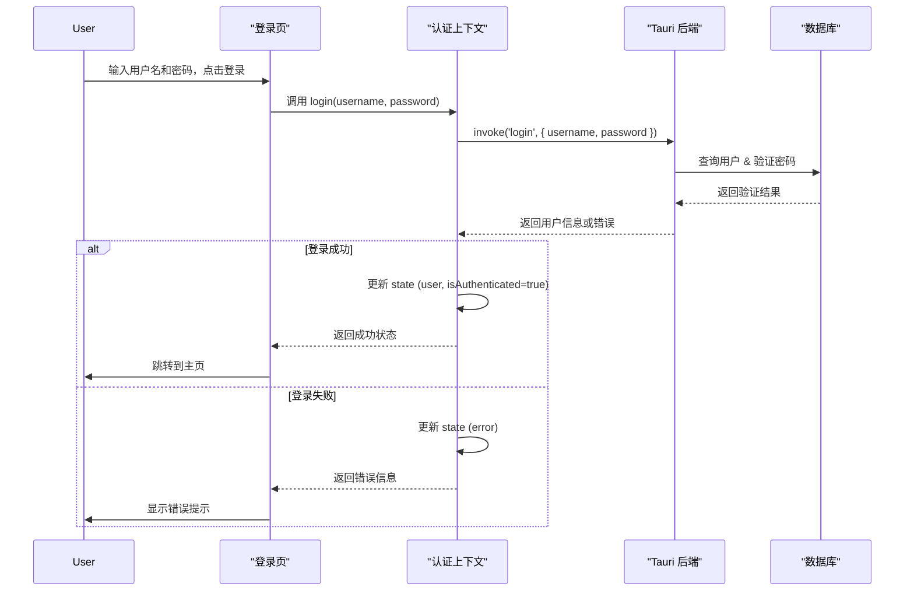

# 登录系统技术设计文档 (TDD)

**版本:** 1.0
**日期:** 2025-07-31

## 1. 系统架构

### 1.1 整体架构
本系统采用 Tauri + Next.js 架构。
- **前端 (Frontend):** 基于 Next.js App Router，使用 React 和 `shadcn/ui` 构建用户界面。负责视图渲染、用户交互和状态管理。
- **后端 (Backend):** 基于 Tauri 的 Rust核心。负责处理业务逻辑、数据库交互、文件系统操作和安全认证。通过 Tauri 的 `invoke` 机制与前端通信。

### 1.2 技术选型

| 模块 | 技术/库 | 选型理由 |
| :--- | :--- | :--- |
| **数据存储** | `mongodb` (Rust Driver) | 根据用户指定要求，使用远程 MongoDB 服务，便于数据集中管理和未来扩展。 |
| **密码加密** | `bcrypt` (Rust Crate) | 行业标准，能有效防止彩虹表攻击，安全性高。 |
| **状态管理** | `React Context` + `useReducer` | 对于全局认证状态管理足够用，是 React 内置方案，无需引入额外依赖。 |
| **表单处理** | `react-hook-form` + `zod` | 项目已引入，可用于实现登录页面的表单校验，保证一致性。 |
| **API通信** | Tauri `invoke` & `Events` | Tauri 官方推荐的跨语言通信方式，高效且安全。 |
| **路由管理** | Next.js App Router | 项目现有路由方案，利用其 `middleware` 或布局嵌套实现路由守卫。 |

### 1.3 架构图

```mermaid
graph TD
    subgraph "前端 (Next.js)"
        A[登录页面 /login] --> B{认证上下文 AuthContext};
        C[后台管理 /admin] --> B;
        D[主应用 /] --> B;
        B --> E[Tauri API (invoke)];
    end

    subgraph "后端 (Tauri - Rust)"
        E --> F{Tauri Commands};
        F --> G[安全模块];
        F --> H[数据库模块];
        F --> I[统计模块];
        G --> J[Bcrypt 加密];
        H --> K[SQLite 数据库];
    end

    subgraph "数据存储 (Remote)"
        H --> K[MongoDB Driver];
        K -- TCP/IP --> L((fa:fa-database MongoDB Server));
        L -- 存储 --> M[Collections: users, tool_usage, ...];
    end

    style A fill:#cde4ff
    style C fill:#cde4ff
    style D fill:#cde4ff
    style B fill:#ffd9b3
    style E fill:#d4ffcd
    style F fill:#d4ffcd
```

## 2. 数据库设计 (MongoDB)

### 2.1 数据模型 (Collections)
数据将存储在指定的远程 MongoDB 数据库中。我们将使用三个主要的集合（Collections）。

**1. `users` 集合**
- **描述:** 存储用户信息。
- **文档结构示例:**
```json
{
  "_id": "ObjectId('...')",
  "username": "admin",
  "password": "<bcrypt_hash>",
  "role": "admin",
  "isActive": true,
  "createdAt": "ISODate('...')",
  "lastLoginAt": "ISODate('...')",
  "totalUsageTime": 12345
}
```

**2. `tool_usage` 集合**
- **描述:** 存储每个用户对每个工具的使用统计。
- **文档结构示例:**
```json
{
  "_id": "ObjectId('...')",
  "userId": "ObjectId('...')", // 关联 users 集合
  "toolId": 1,
  "clickCount": 100,
  "totalUsageTime": 7200,
  "lastUsedAt": "ISODate('...')"
}
```

**3. `user_sessions` 集合**
- **描述:** 记录用户登录会话。
- **文档结构示例:**
```json
{
  "_id": "ObjectId('...')",
  "userId": "ObjectId('...')", // 关联 users 集合
  "loginAt": "ISODate('...')",
  "logoutAt": "ISODate('...')",
  "sessionDuration": 3600
}
```

### 2.2 数据持久化策略
- **记住密码:** 将加密后的用户名和密码存储在 Tauri 的 `store` 插件或本地加密文件中。
- **自动登录:** 生成一个长期有效的 Token，安全地存储在本地。应用启动时，使用此 Token 自动完成登录验证。

## 3. API 设计 (Tauri Commands)

所有 API 均通过 Tauri `invoke` 调用。Rust 端负责实现这些 `#[tauri::command]`。

### 3.1 认证接口
- `login(username: String, password: String) -> Result<User, String>`
  - **描述:** 验证用户凭据。
  - **逻辑:**
    1. 根据 `username` 查询用户。
    2. 使用 `bcrypt::verify` 校验密码。
    3. 如果成功，更新 `last_login_at`，创建会话记录。
    4. 返回用户信息（不含密码）。
- `logout(session_id: String) -> Result<(), String>`
  - **描述:** 用户登出。
  - **逻辑:** 更新对应 `user_sessions` 记录的 `logout_at` 和 `session_duration`。
- `check_session() -> Result<User, String>`
  - **描述:** 检查当前是否存在有效会话（用于自动登录）。
  - **逻辑:** 验证本地存储的 Token，返回用户信息。

### 3.2 用户管理接口 (限管理员)
- `get_all_users() -> Result<Vec<User>, String>`
- `create_user(username: String, password: String, role: String) -> Result<User, String>`
- `update_user(id: String, username: String) -> Result<User, String>`
- `reset_password(id: String, new_password: Option<String>) -> Result<(), String>`
- `toggle_user_status(id: String, is_active: bool) -> Result<(), String>`
- `delete_user(id: String) -> Result<(), String>`

### 3.3 统计接口
- `track_tool_click(user_id: String, tool_id: i32)`
- `track_tool_usage(user_id: String, tool_id: i32, duration: i32)`
- `get_user_stats(user_id: String) -> Result<Vec<ToolUsage>, String>`
- `get_system_stats() -> Result<serde_json::Value, String>`

## 4. 前端实现方案

### 4.1 认证流程
1.  **创建 `AuthContext`:**
    - 在 `app/lib/auth` 目录下创建 `AuthContext.tsx`。
    - Context 将提供 `user`, `isAuthenticated`, `login`, `logout`, `loading` 等状态和方法。
    - 使用 `useReducer` 管理复杂的状态逻辑。
2.  **包裹根布局:**
    - 在 `app/layout.tsx` 中，使用 `AuthProvider` 包裹 `{children}`，使全局可访问认证状态。
3.  **路由保护:**
    - 创建一个高阶组件 `withAuth` 或在布局文件中检查认证状态。
    - 对于需要登录的页面，如果 `isAuthenticated` 为 `false`，则使用 Next.js 的 `redirect` 函数跳转到 `/login`。
    - 对于 `/admin` 页面，额外检查 `user.role === 'admin'`。
4.  **登录页面 (`/login/page.tsx`):**
    - 使用 `react-hook-form` 和 `zod` 进行表单构建和验证。
    - `onSubmit` 时调用 `AuthContext` 提供的 `login` 方法，该方法内部会 `invoke` 后端 `login` 命令。
    - 根据 `loading` 和错误状态显示 UI 反馈。

### 4.2 状态管理图



## 5. 安全性设计

- **密码存储:** 绝不存储明文密码。Rust 端的 `bcrypt` 库负责生成和验证密码哈希。
- **会话管理:**
  - 登录成功后，后端可生成一个安全的、有时效性的 JWT（JSON Web Token），存储在前端。后续请求通过此 Token 验证。
  - 或者，利用 Tauri 的封闭环境，在 Rust 端管理一个会话状态，前端通过 `check_session` 命令验证。后者更简单且同样安全，因为没有暴露在开放网络中。
- **权限控制:**
  - 前端进行初步的路由跳转控制，提供良好用户体验。
  - **后端必须对所有需要权限的 Command 进行严格的检查**，从会话中获取用户角色，判断其是否有权执行该操作。绝不信任来自前端的任何角色信息。
- **输入校验:** 前后端都需要对输入数据进行校验，防止注入等攻击。
